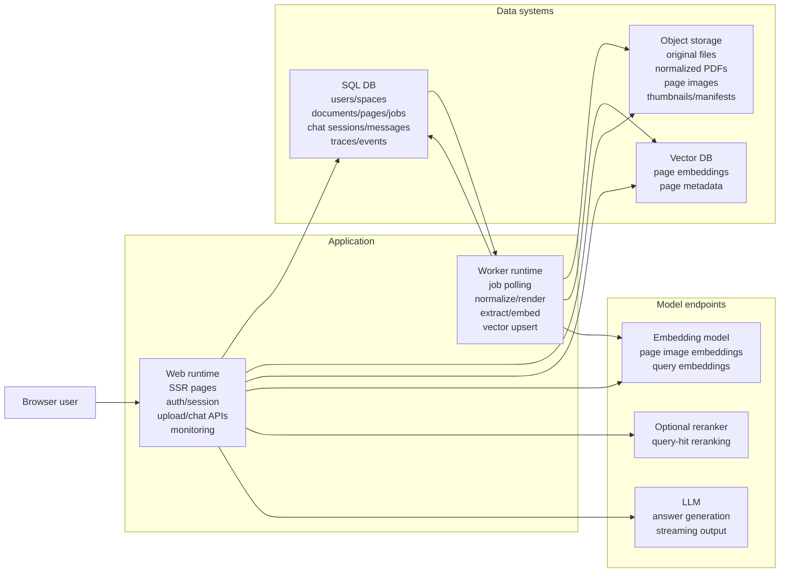
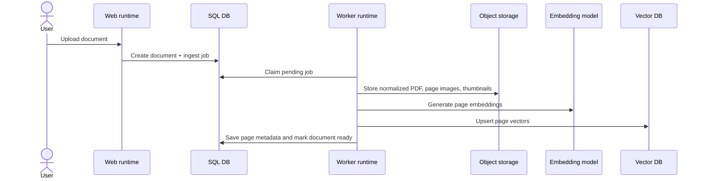
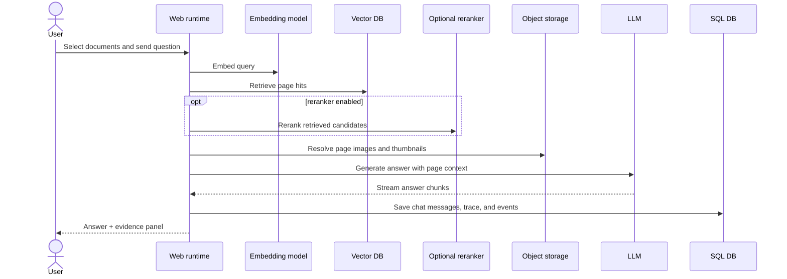

# mm-rag-demo

`mm-rag-demo` is a simple-demo internal multimodal RAG app built with FastAPI, Jinja2, HTMX, Alpine.js, and LangGraph. It keeps a single monorepo and a single full-stack Python app while splitting runtime responsibilities into `web` and `worker`.

For local development the default adapter set is:

- `SQLite` for the relational store
- local filesystem storage for document assets
- a nano-style local vector store for page embeddings

## Scope

- SSR pages for dashboard, documents, chat, and monitoring
- GitHub OAuth, with optional local-only `AUTH_BYPASS=true`
- Ingestion pipeline: upload -> job -> normalize -> render -> extract -> embed -> upsert
- LangGraph-based RAG flow with retrieval, optional reranking, neighbor expansion, generation, and evidence
- Basic observability with `trace_id`, app events, and recent job/chat/event views
- Adapter skeletons for MySQL, S3-compatible storage, and Elasticsearch

## System workflow

### System overview



Mermaid gets cramped when every object is listed inside the diagram, so the table below keeps the component list readable on GitHub.

| System | Main objects |
| --- | --- |
| Web runtime | SSR pages, auth/session handling, upload endpoints, chat endpoints, SSE streaming, monitoring views |
| Worker runtime | ingest job polling, PDF normalization, page rendering, text extraction, embedding calls, vector upsert |
| SQL DB | users, spaces, documents, document pages, ingest jobs, chat sessions, chat messages, retrieval traces, app events |
| Object storage | original uploads, normalized PDFs, page images, thumbnails, manifests, extracted text artifacts |
| Vector DB | page embeddings, page metadata, retrieval records |
| Embedding model | image embeddings for document pages, text/query embeddings for retrieval |
| Reranker | optional reranking for retrieved candidates |
| LLM | final answer generation and streamed response chunks |

### Use case: document ingest



### Use case: document chat



## Status

- The local development profile is the primary validated path right now.
- The production profile is still under review and has not been fully validated end to end yet.
- Production-oriented adapters and deployment manifests exist in the repository, but they should still be treated as in-progress until they are smoke-tested together.

## Recommended local setup

1. Create a virtual environment

```bash
python3 -m venv .venv
source .venv/bin/activate
```

2. Install dependencies

```bash
python -m pip install --upgrade pip
pip install -e ".[dev]"
```

3. Prepare environment variables

```bash
cp .env.example .env
```

4. Open `.env` and choose the development profile. The file now separates local and production-oriented settings with comment blocks.

5. If you want to skip GitHub OAuth locally, edit `.env` and set:

```bash
AUTH_BYPASS=true
APP_DEBUG=true
```

6. Initialize the database schema (runs `alembic upgrade head`)

```bash
python scripts/init_db.py
```

7. Start the web app

```bash
python scripts/dev_web.py
```

8. Start the worker

```bash
python scripts/dev_worker.py
```

9. Open the app

- http://localhost:8080

## Local behavior

- With `AUTH_BYPASS=true`, visiting `/login` signs you in as a fixed local development user.
- If `EMBEDDING_API_BASE`, `RERANKER_API_BASE`, and `LLM_API_BASE` are empty, the app falls back to deterministic local behavior for demo/test flows.
- OpenRouter embeddings can use either `EMBEDDING_*` or the `OPENROUTER_API_BASE`, `OPENROUTER_API_KEY`, and `OPENROUTER_MODEL` aliases.
- `txt`, `md`, and `pdf` run through the local ingest path without extra system dependencies.
- `doc`, `docx`, `ppt`, and `pptx` use headless LibreOffice conversion when `soffice` is available.
- The UI uses self-hosted `Noto Sans KR`, so Linux deployments render the same font stack as local development.

## Security notes

- `.env.example` uses safe-ish defaults for a checked-in example, not recommended shared or production values.
- `AUTH_BYPASS` is disabled by default and must stay disabled in production.
- `APP_DEBUG` is disabled by default and must stay disabled in production.
- `SECRET_KEY` must be replaced before any shared or production deployment.
- `SESSION_COOKIE_HTTPONLY` is fixed to `true` with the current Starlette session middleware.

## Key files

- Web app entrypoint: `app/main.py`
- Worker loop: `app/workers/runner.py`
- Ingestion service: `app/services/ingestion_service.py`
- RAG preparation graph: `app/pipelines/rag/graph.py`

## Testing

```bash
pytest
```

Python `3.11` or `3.12` is recommended. The project can run on newer Python versions, but current LangChain/LangGraph dependencies still emit warnings on Python `3.14`.

## Notes

- `venv + pip` is the recommended development path for this repository.
- You can still use `uv` if you prefer, but the documented and verified workflow is based on `venv`.

## TODO / Validation gaps

- Validate the full production profile end to end with `MySQL + S3-compatible storage + Elasticsearch`.
- Smoke-test the production GitHub OAuth flow against a real shared environment.
- Verify the Alembic migration workflow from a clean database on both SQLite and MySQL.
- Validate LibreOffice-based `doc/docx/ppt/pptx` conversion on a clean Linux host.
- Smoke-test the Dockerfiles, local compose setup, and Kubernetes manifests in a fresh environment.
- Harden and verify streaming behavior for long-running generations, reconnects, and interrupted SSE sessions.
- Expand integration coverage for non-local adapters and real model-provider combinations beyond the currently tested local/simple-demo path.
